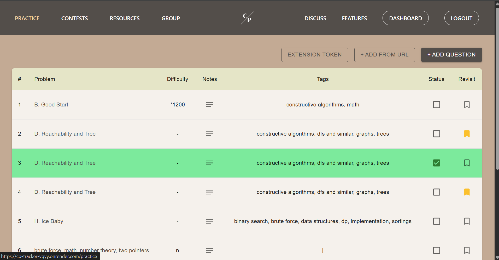
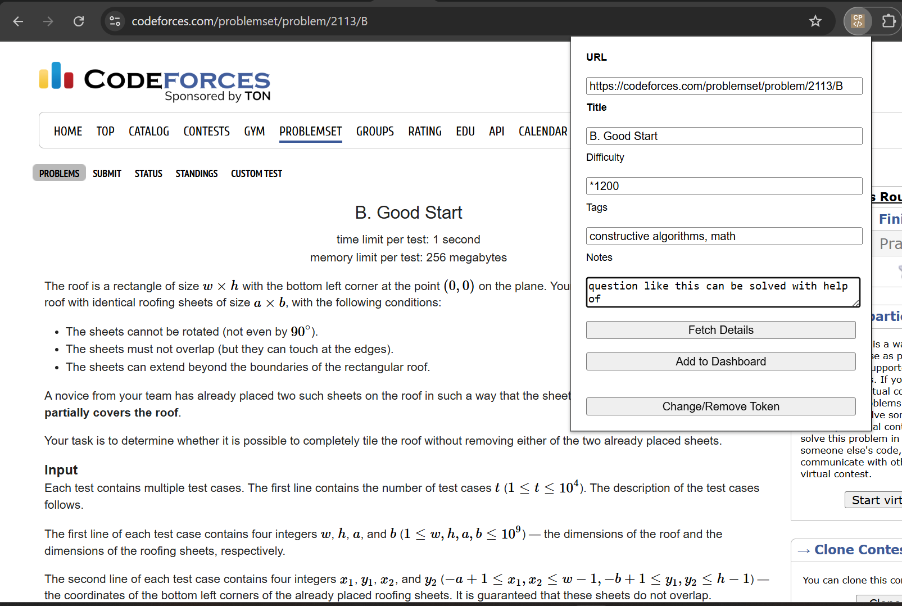
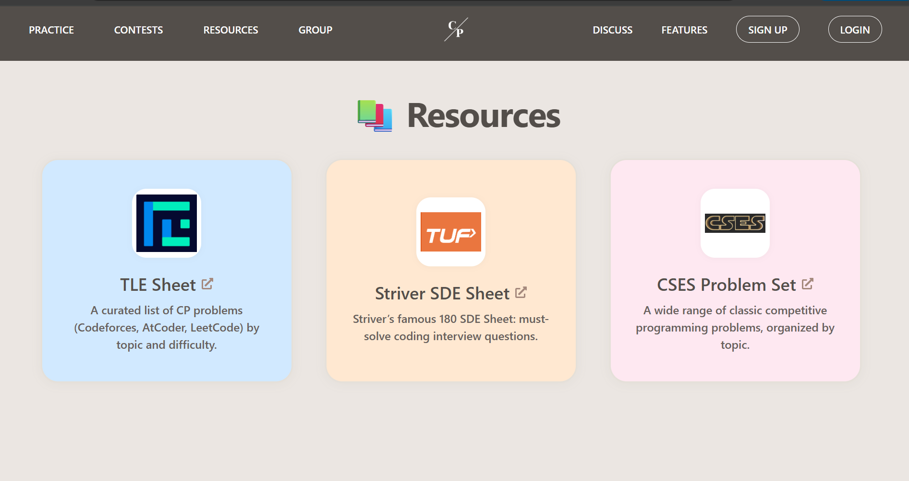

# CodeFlow: Competitive Programming Companion


[](https://codeflow-frontend.onrender.com)
[](https://github.com/yourusername/codeflow-extension)
[](LICENSE)

> Your all-in-one toolkit to manage, track, and accelerate your competitive programming journey.

---

## 🚀 Live Demo

**Frontend (React):** [https://cp-tracker-vqyy.onrender.com/](https://cp-tracker-vqyy.onrender.com/)

**Backend (Node.js):** [https://cp-tracker-b5c9.onrender.com](https://cp-tracker-b5c9.onrender.com)

---

## 🎯 Features

### 🔎 Smart Problem Tracker

* Add problems manually or paste a URL from **LeetCode** or **Codeforces** to auto-fetch details like title, difficulty, and tags.
* Categorize by status (To-do, Solved, Revisit) and custom tags.

### 🌐 Chrome Extension Integration

* One-click problem saving from any supported problem page.
* Background communication with backend to parse and save instantly.

### 📅 CP Contest Calendar

* View upcoming contests across major platforms (AtCoder, LeetCode, Codeforces, etc.).
* Fully interactive with filters.

### 📊 Dashboard

* Search, filter, sort problems.
* Track your progress visually.

### ⚙️ Technologies Used

* **Frontend:** React, TailwindCSS, Framer Motion, Axios, React Router, MUI
* **Backend:** Node.js, Express, MongoDB, Puppeteer, Cheerio,Docker
* **Chrome Extension:** Manifest V3, JS Background Scripts, Messaging APIs
* **Deployment:** Render (Full Stack)

---

## 📸 Screenshots

| Screen                  | Description                           |
| ----------------------- | ------------------------------------- |
|  | Problem dashboard with tags, notes    |
|    | Adding problem using extension        |
|   | Random Practice Problem page          |
|  | Curated resource page with animations |


---

## 🛠️ Setup Instructions


###  Backend

You can run the backend either locally or inside a Docker container (recommended for Puppeteer scraping support).

### 🔧 Option 1: Run Locally

```bash
git clone https://github.com/Arunima2305/codeflow-backend.git
cd codeflow-backend
npm install
npm start
```

✅ Make sure you have the following in your `.env` file:

```env
PORT=5000
MONGO_URI=your_mongodb_url
```

**Note:** If you are using Puppeteer locally (for Codeforces scraping), make sure Google Chrome is installed or Puppeteer can find Chromium. Otherwise, use Docker (see below).

---

### 🐳 Option 2: Run with Docker (Recommended for Puppeteer)

```bash
git clone https://github.com/Arunima2305/cp-tracker
cd backend
docker build -t backend .
docker run -p 5000:5000 --env-file .env backend
```

This setup ensures Puppeteer runs headless Chrome properly, which is required for Codeforces scraping.


### Frontend

```bash
git clone https://github.com/Arunima2305/cp-tracker
cd frontend
npm install
npm run build # or npm start for dev
```

### Chrome Extension (Local)

* Go to `chrome://extensions`
* Enable Developer Mode
* Click "Load Unpacked" and select the `extension/` folder

---

## 📦 Future Enhancements

* 🧠 AI-based problem recommendation engine based on solved tags and behavior
* 📈 Visual analytics dashboard (solve trends, difficulty progression)
* 👯 Friend Leaderboard & Collaboration

---

## 🙌 Contributing

Pull requests and stars are welcome! Feel free to fork the project and submit improvements or ideas.

---

## 🧾 License

This project is licensed under the MIT License - see the [LICENSE](LICENSE) file for details.

---

## ✨ Acknowledgments

* Problem metadata parsing via Puppeteer & LeetCode GraphQL

---

Made with ❤️ by Arunima
