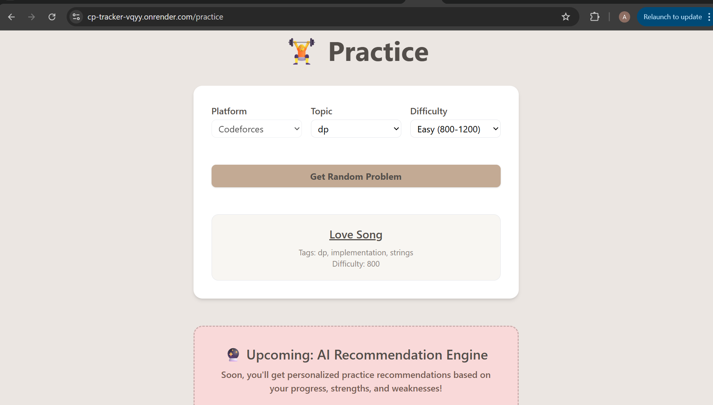

# CodeFlow: Smart CP Practice Tracker + Chrome Extension

CodeFlow is a productivity-focused web application designed to help competitive programmers **track, manage, and enhance** their coding practice efficiently.

It features a beautifully crafted React-based frontend, a robust Node.js + Express backend, and a powerful **Chrome Extension** that extracts coding problem metadata from popular platforms like **LeetCode** and **Codeforces**—with just a click.

---

## 🚀 Features

### 🌐 Web App

* 🧩 **Dashboard** to organize and filter solved problems by tags, difficulty, and revisit intent.
* ✍️ **Notes section** per problem to record logic, edge cases, or mistakes.
* 📥 **Manual Entry** and **Add via URL** support.
* 🎯 **Practice Page** with:

  * 🎲 Random problem suggestion
  * 🧠 AI-powered recommendation engine (Coming Soon!)
* 📚 **Resources Page** with curated links:

  * TLE Sheet
  * Striver SDE Sheet
  * CSES Problem Set

### 🧩 Chrome Extension

* ⚡ 1-click parsing of problem title, difficulty, and tags
* 📝 Auto-fill problem info in dashboard
* 🔐 Token-based authentication
* 🌐 Works with LeetCode and Codeforces

---

## 🛠️ Tech Stack

* **Frontend:** React, Tailwind CSS, Framer Motion, React Router DOM, Axios
* **Backend:** Node.js, Express.js, MongoDB, Puppeteer (via Docker), Cheerio, JWT Auth
* **Chrome Extension:** HTML, JS, React Hooks, Manifest v3
* **Deployment:** Render (frontend + backend), GitHub Pages (extension)

---

## 📸 Screenshots

| Screen                  | Description                           |
| ----------------------- | ------------------------------------- |
|  | Problem dashboard with tags, notes    |
|    | Adding problem using extension        |
|   | Random Practice Problem page          |
|  | Curated resource page with animations |


---

## 🧑‍💻 Setup Locally

### 🐳 Backend (Dockerized with Puppeteer support)

```bash
git clone https://github.com/your-username/codeflow.git
cd codeflow/backend

# Create .env with MONGO_URI, JWT_SECRET, and optionally PORT
cp .env.example .env

# Build and start
docker build -t codeflow-backend .
docker run -p 5000:5000 codeflow-backend
```

### 💻 Frontend

```bash
cd ../frontend
npm install

# Create .env
REACT_APP_BASE_URL=http://localhost:5000

npm start
```

### 🔌 Chrome Extension (Dev Mode)

1. Navigate to `chrome-extension/` folder
2. Open `chrome://extensions/` in your browser
3. Enable **Developer Mode**
4. Click **Load unpacked** → Select `chrome-extension`
5. Open a coding problem → click extension to auto-fill it in dashboard

---

## 🌍 Deployment (Render.com)

* Deploy **frontend** as static React app with `npm run build`
* Deploy **backend** as a Docker service (Render supports this directly)
* Add environment variables in dashboard

---

## 📌 Upcoming

* 🧠 AI Recommendation System based on user history
* 🧠 Personalized revision plans

---

## 🤝 Contributing

```bash
git checkout -b feature/your-feature-name
git commit -m "Add your changes"
git push origin feature/your-feature-name
```

Then create a PR 🚀

---

## 📃 License

MIT

---

## 📬 Contact

Created by Arunima(https://github.com/Arunima2305) • Contributions welcome!
